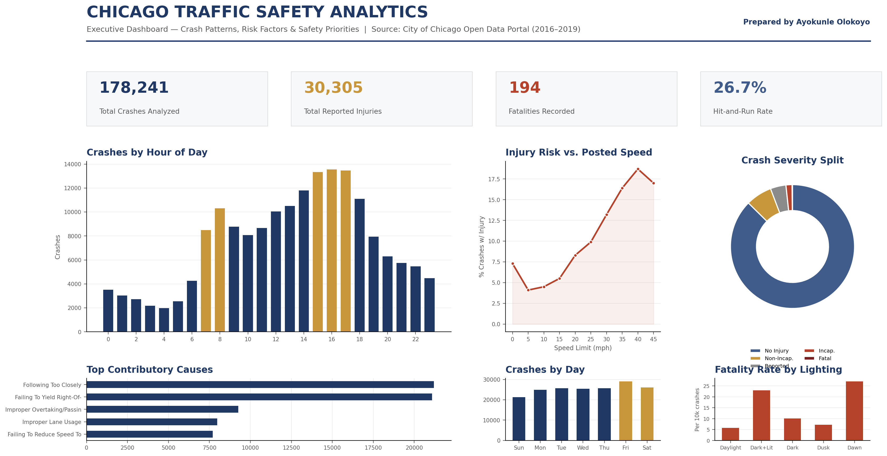

# Chicago Traffic Safety Analytics

**A Data Story on Crash Patterns, Risk Factors, and Evidence-Based Safety Priorities**



> *Executive dashboard built from 178,241 real Chicago Police Department crash records (2016–2019), sourced from the [City of Chicago Open Data Portal](https://data.cityofchicago.org/Transportation/Traffic-Crashes-Crashes/85ca-t3if).*

---

## About This Project

Traffic safety agencies sit on enormous volumes of crash data — but volume alone does not create insight. This project asks three questions that a policy team actually needs answered:

1. **When do crashes happen**, and does that match where enforcement and public-awareness resources are currently focused?
2. **What role does posted speed play** in whether a crash results in injury?
3. **Which conditions** — lighting, weather, contributing driver behaviour — carry the highest *real* risk, as opposed to simply the highest raw crash count?

The analysis moves from raw public data through cleaning, aggregation, risk-rate calculation, visualization, and a set of evidence-based recommendations — the same end-to-end workflow I apply professionally when delivering analytical insights to government and enterprise stakeholders.

---

## Key Findings

| # | Finding | Implication |
|---|---------|-------------|
| 1 | Crash timing **closely tracks the commute** — sharp peaks at 7–8 AM and 3–6 PM account for ~1 in 3 crashes | Enforcement and awareness campaigns have an obvious, evidence-backed time window to target |
| 2 | **Injury rate rises nearly five-fold** from low to high posted speed limits (4% → 19%) | Speed-limit review and traffic-calming on higher-speed corridors is where injury risk concentrates |
| 3 | **Darkness on a lighted road** carries a *higher* fatality rate than full darkness | Lighting is a marker for road type and speed — "add more lighting" would be the wrong intervention |
| 4 | **Following too closely** and **failure to yield** dominate identified behavioural causes | Driver-education and targeted enforcement campaigns have a plausible, evidence-based case for impact |
| 5 | **Weekend crash volumes are highest** and compound with weather-related injury-rate increases | Weekend-evening, adverse-weather driving is a distinct risk window for seasonal safety campaigns |

---

## Repository Structure

```
chicago-traffic-safety-analytics/
│
├── notebooks/
│   └── Chicago_Traffic_Safety_Analytics.ipynb   ← Full documented analysis notebook
│
├── charts/
│   ├── dashboard_hero.png                        ← Composite executive dashboard (hero image)
│   ├── chart_hourly.png                          ← Crashes by hour of day
│   ├── chart_speed.png                           ← Injury risk vs. posted speed limit
│   ├── chart_causes.png                          ← Top contributory causes
│   ├── chart_severity.png                        ← Crash severity distribution
│   ├── chart_dow.png                             ← Crashes by day of week
│   └── chart_lighting.png                        ← Fatality rate by lighting condition
│
├── data/
│   └── crashes_sample.csv                        ← 5,000-row representative sample (runnable out of the box)
│
├── portfolio_document/
│   └── Ayokunle_Olokoyo_Portfolio_ChicagoTrafficSafetyAnalytics.pdf   ← Full formatted portfolio piece
│
├── requirements.txt
├── .gitignore
└── README.md
```

---

## Getting Started

### 1. Clone the repository

```bash
git clone https://github.com/awisespirit/chicago-traffic-safety-analytics.git
cd chicago-traffic-safety-analytics
```

### 2. Install dependencies

```bash
pip install -r requirements.txt
```

### 3. Run the notebook

```bash
jupyter notebook notebooks/Chicago_Traffic_Safety_Analytics.ipynb
```

The notebook runs out of the box using the **5,000-row sample** included in `/data/crashes_sample.csv`.

---

## Reproducing the Full Analysis (178,241 rows)

To run the full dataset:

1. Download the complete crash records from the **City of Chicago Open Data Portal**:
   [https://data.cityofchicago.org/Transportation/Traffic-Crashes-Crashes/85ca-t3if](https://data.cityofchicago.org/Transportation/Traffic-Crashes-Crashes/85ca-t3if)
   *(Export → CSV → Download)*

2. Save the file as `data/crashes_full.csv`

3. In the notebook, update the load cell:
   ```python
   # Change this line:
   df = pd.read_csv("../data/crashes_sample.csv")

   # To this:
   df = pd.read_csv("../data/crashes_full.csv")
   ```

4. Re-run all cells. All findings and visualizations will reproduce exactly.

---

## Tools & Methods

| Tool | Purpose |
|------|---------|
| **Python / pandas** | Data loading, cleaning, aggregation, and feature engineering |
| **matplotlib** | All chart and dashboard visualizations |
| **Jupyter Notebook** | End-to-end documented analysis workflow |
| **City of Chicago Open Data Portal** | Source data (public, unmodified) |

**Analytical approach:**
- Injury rates calculated as a **share of crashes**, not raw counts, to separate genuine risk from traffic volume effects
- Full-year filter (2016–2018) applied for trend analysis to ensure consistent citywide reporting coverage
- Dashboard design follows KPI-first, one-message-per-panel principles consistent with professional Power BI executive dashboard delivery

---

## Portfolio Document

The `/portfolio_document` folder contains a professionally formatted 4-page write-up covering:
- The analytical question and objectives
- Data and methodology
- The full dashboard with all six panels
- Five key findings with analytical commentary
- Evidence-based recommendations for a traffic safety team

This document was prepared as a supporting portfolio piece for senior data analyst roles in traffic safety, public safety, and government analytics.

---

## About the Author

**Ayokunle Olokoyo**
Senior Data Analyst | Advanced Analytics, Dashboards & Predictive Modeling

17+ years of experience leading complex analysis, dashboard development, and evidence-based reporting for government and enterprise stakeholders — including five years managing analytics and BI delivery across four government-owned organizations.

- 📧 awisespirit@gmail.com
- 🔗 [LinkedIn](https://www.linkedin.com/in/ayokunle-olokoyo-86b0b864/)
- 💻 [GitHub Portfolio](https://github.com/awisespirit)

---

## Data Source & Attribution

All crash records used in this analysis are sourced from the **City of Chicago Open Data Portal** and are publicly available under the City of Chicago's open data license. No data has been modified, anonymized, or altered from the original source. This project is an independent analytical work and is not affiliated with the City of Chicago or the Chicago Police Department.

**Source:** [Traffic Crashes — Crashes, Chicago Data Portal](https://data.cityofchicago.org/Transportation/Traffic-Crashes-Crashes/85ca-t3if)
Records: 178,241 | Period: 2016–2019 | Reported by: Chicago Police Department
